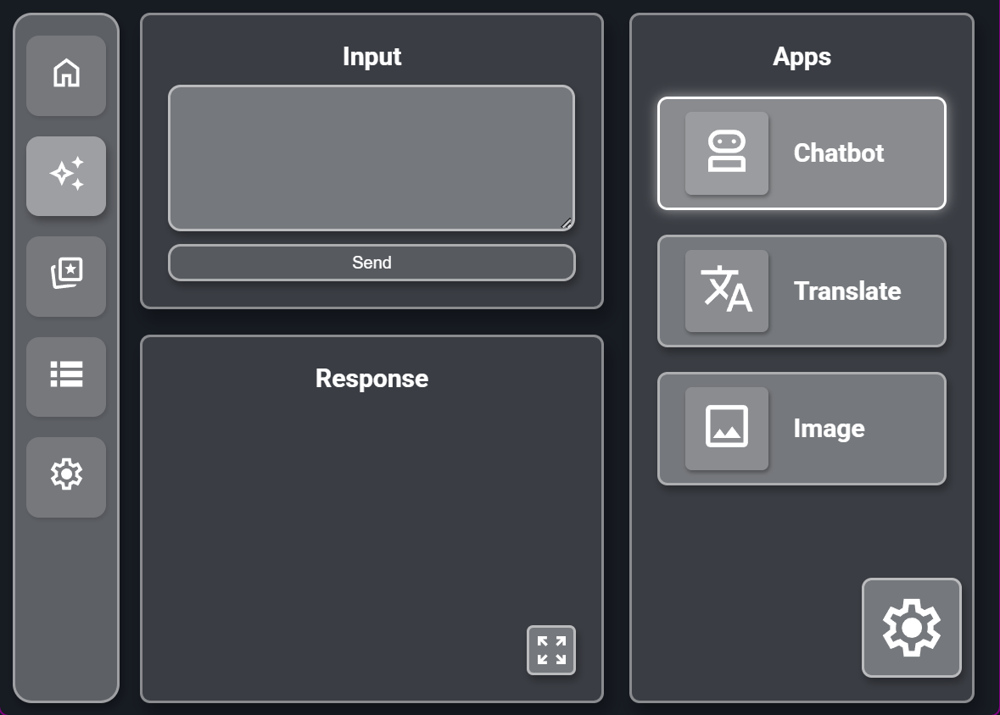
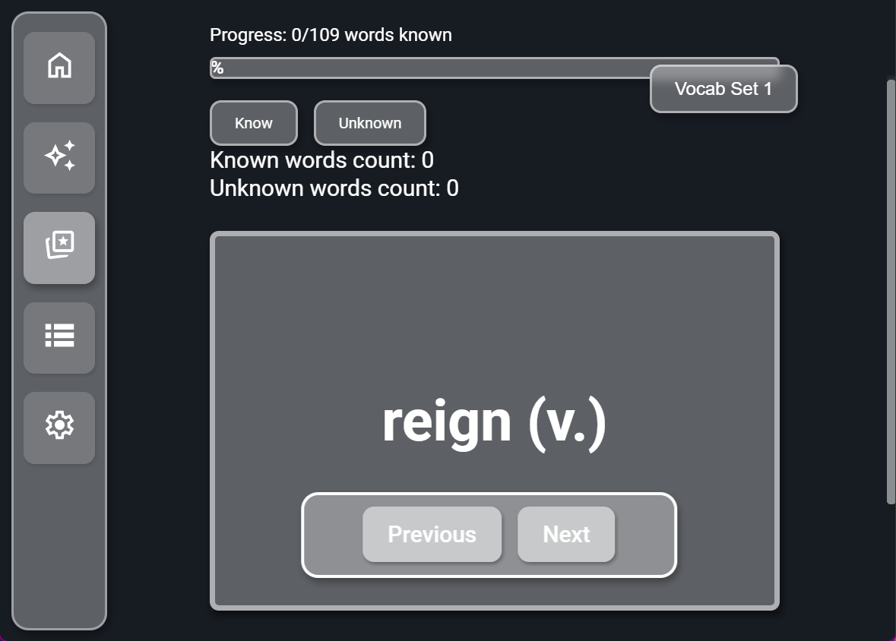
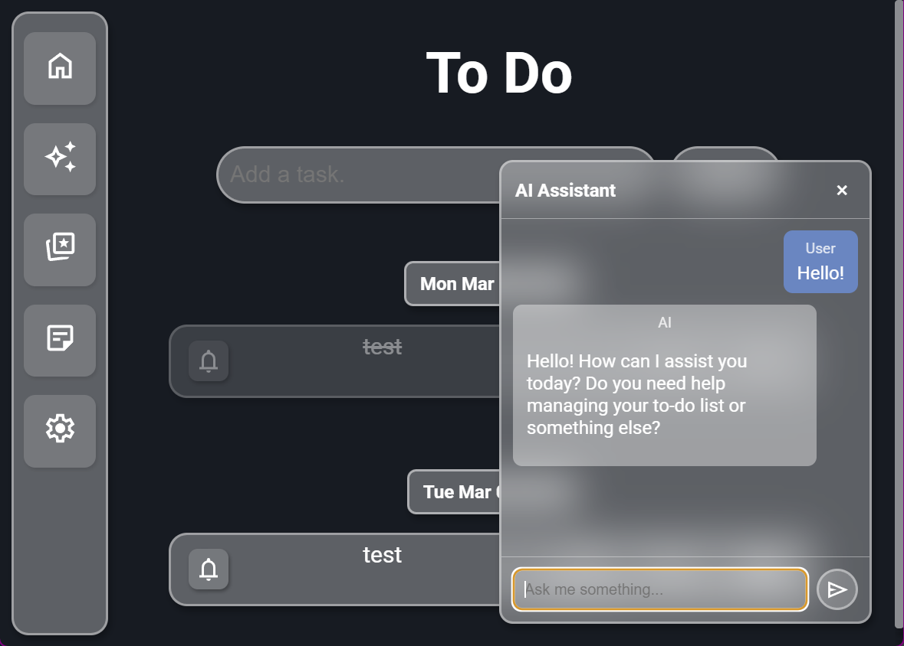
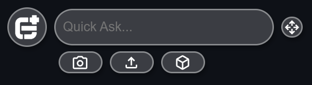

<h1><b>GPE Hub</b></h1>

<i>A toolbox by GPE Club for THIS students Made by Will Li</i>

  
 

Downloads for Windows and MacOS are available at [Release](https://github.com/BroWo1/GPE-Hub/releases)

## Features
* ### AI Toolbox    
* ### SAT Vocab Flashcard    
* ### AI Todo List    
* ### GPE Ball    